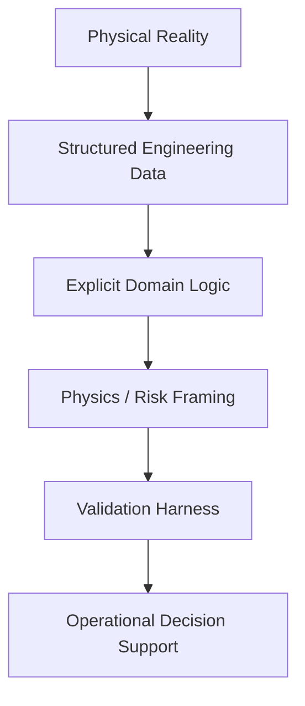

<!-- =========================================================
Felipe Rocha — Profile README
High-clarity | Professional | Engineering-first
========================================================== -->

<h1 align="center">Felipe Rocha</h1>

<p align="center">
  <strong>Asset Integrity Engineer</strong><br/>
  RBI Decision Systems • Engineering Data Architecture • Physics-Constrained ML • Secure Automation
</p>

<p align="center">
  <a href="mailto:feliper@infinitygrowth.ca">
    
  </a>
  <a href="https://www.linkedin.com/in/felipe-rocha-7a944b133/">
    
  </a>
</p>

<p align="center">
  
  
  
  
</p>

---

## Engineering Profile

I design and implement decision-support systems for asset integrity and risk-based inspection (RBI) programs.

My work operates at the boundary between engineering judgment, structured data systems, and applied machine learning. The objective is not algorithmic novelty — the objective is defensible operational decisions.

Systems are built to ensure:

- Explicit assumptions  
- Transparent transformation logic  
- Inspectable data lineage  
- Bounded model behavior  
- Visible failure modes  

---

## System Architecture Philosophy



Engineering judgment is preserved — not replaced.  
Automation reduces ambiguity, not accountability.

---

## Core Domains

### Integrity & RBI Decision Logic

```python
class DegradationModel:

    def __init__(self, rate: float, uncertainty: float):
        self.rate = max(rate, 0.0)
        self.uncertainty = uncertainty

    def adjusted_rate(self, inspection_effectiveness: float) -> float:
        return self.rate * (1 - inspection_effectiveness)

    def probability_of_failure(self, exposure_time: float) -> float:
        adjusted = self.adjusted_rate(...)
        return risk_transform(adjusted, exposure_time, self.uncertainty)
```

Design constraints:
- No hidden parameters  
- No silent normalization  
- No implicit bounds  
- Explicit uncertainty propagation  

---

### Engineering Data Architecture

```sql
CREATE TABLE inspection_record (
    asset_id VARCHAR(64) NOT NULL,
    inspection_date DATE NOT NULL,
    thickness_mm NUMERIC(6,3),
    degradation_mechanism TEXT,
    validated BOOLEAN DEFAULT FALSE,
    PRIMARY KEY (asset_id, inspection_date)
);
```

Architectural priorities:

- Schemas aligned with physical meaning  
- Validation at ingestion  
- Deterministic transformations  
- Version-controlled logic  
- Full audit trail  

Data quality is treated as an engineering risk variable.

---

### Physics-Constrained Computation

```python
dV_ds  = longitudinal_force_balance(...)
dAlpha = lateral_equilibrium(...)
dT_dt  = thermal_response(...)
dWear  = wear_model(...)
```

Process order:

1. Define governing equations  
2. Define boundary conditions  
3. Select numerical method  
4. Validate against physical expectations  
5. Introduce ML only if system cannot be analytically closed  

No parameter without justification.

---

### Applied Machine Learning (Bounded)

```text
Model Output ⊂ Physical Feasibility Region
```

Requirements:

- Explicit input domain  
- Enforced output bounds  
- Sensitivity analysis  
- Out-of-distribution stress testing  
- Documented model limitations  

Accuracy alone is insufficient.

---

### Secure-by-Design Automation

```yaml
system_properties:
  deterministic_execution: true
  reproducible_pipelines: true
  trust_boundaries_defined: true
  tamper_evident_transforms: true
  decision_audit_trails: required
```

In connected industrial systems, data integrity becomes an engineering variable.

Security is structural, not procedural.

---

## Technical Stack

<p align="center">
  
  
  
  
  
  
</p>

Primary language: **Python**  
Design emphasis: **Reproducibility • Auditability • Determinism**

---

## Engineering Principles

```text
If an assumption is not written, it will fail silently.

If data lineage is not explicit, the decision is not defensible.

If a model cannot define its boundary conditions,
it is not operational.
```

---

## Contact

feliper@infinitygrowth.ca  
felipe@olivainternationaltech.com  
https://www.linkedin.com/in/felipe-rocha-7a944b133/

Open to technical discussions involving:

- Asset integrity digitalization  
- RBI architecture  
- Physics-informed modeling  
- Engineering-grade automation  
- Secure industrial data systems  
