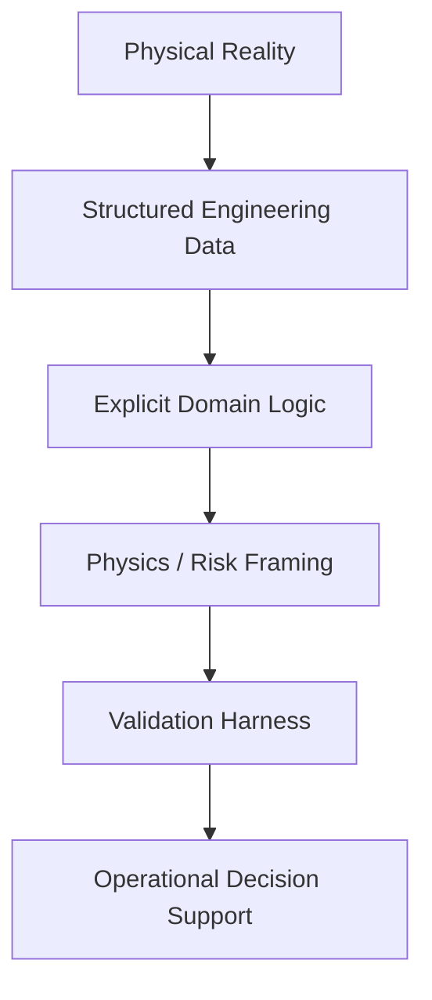

<!-- =========================================================
Felipe Rocha — Profile README
High-clarity | Professional | Engineering-first
========================================================== -->

<h1 align="center">Felipe Rocha</h1>

<p align="center">
  <strong>Asset Integrity Engineer</strong><br/>
  RBI Decision Systems • Engineering Data Architecture • Physics-Constrained ML • Secure Automation
</p>

<p align="center">
  <a href="mailto:feliper@infinitygrowth.ca">
    
  </a>
  <a href="https://www.linkedin.com/in/felipe-rocha-7a944b133/">
    
  </a>
</p>

<p align="center">
  
  
  
  
</p>

---

## Engineering Profile

I design and implement decision-support systems for asset integrity and risk-based inspection (RBI) programs.

My work operates at the boundary between engineering judgment, structured data systems, and applied machine learning. The objective is not algorithmic novelty — the objective is defensible operational decisions.

Systems are built to ensure:

- Explicit assumptions  
- Transparent transformation logic  
- Inspectable data lineage  
- Bounded model behavior  
- Visible failure modes  

---

## System Architecture Philosophy



Engineering judgment is preserved — not replaced.  
Automation reduces ambiguity, not accountability.

---


Architectural priorities:

- Schemas aligned with physical meaning  
- Validation at ingestion  
- Deterministic transformations  
- Version-controlled logic  
- Full audit trail  

Data quality is treated as an engineering risk variable.


## Technical Stack

<p align="center">
  
  
  
  
  
  
</p>

Primary language: **Python, HTML, Javascript**  
Design emphasis: **Reproducibility • Auditability • Determinism**

---

## Engineering Principles

```text
If an assumption is not written, it will fail silently.

If data lineage is not explicit, the decision is not defensible.

If a model cannot define its boundary conditions,
it is not operational.
```

---

## Contact

feliper@infinitygrowth.ca  
felipe@olivainternationaltech.com  
https://www.linkedin.com/in/felipe-rocha-7a944b133/

Open to technical discussions involving:

- Asset integrity digitalization  
- RBI architecture  
- Physics-informed modeling  
- Engineering-grade automation  
- Secure industrial data systems  
