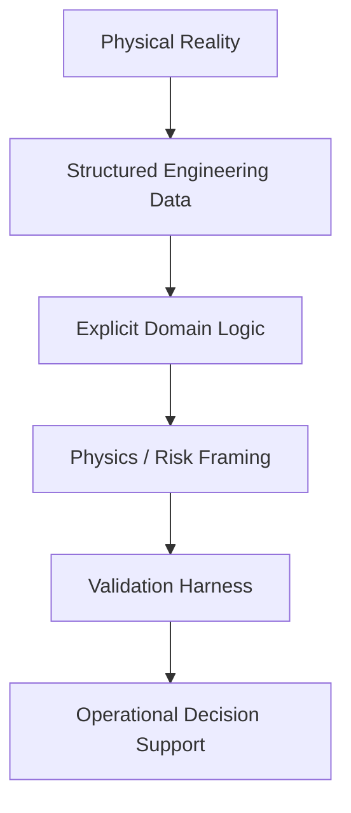

<!-- =========================================================
Felipe Rocha — Profile README
High-clarity | Professional | Engineering-first
========================================================== -->

<h1 align="center">Felipe Rocha</h1>

<p align="center">
  <strong>Asset Integrity Engineer</strong><br/>
  RBI Decision Systems • Engineering Data Architecture • Physics-Constrained ML • Secure Automation
</p>

<p align="center">
  <a href="mailto:feliper@infinitygrowth.ca">
    
  </a>
  <a href="https://www.linkedin.com/in/felipe-rocha-7a944b133/">
    
  </a>
</p>

<p align="center">
  
  
  
  
</p>

---

## Engineering Profile

I design and implement decision-support systems for asset integrity and risk-based inspection (RBI) programs.

My work operates at the boundary between engineering judgment, structured data systems, and applied machine learning. The objective is not algorithmic novelty — the objective is defensible operational decisions.

Systems are built to ensure:

- Explicit assumptions  
- Transparent transformation logic  
- Inspectable data lineage  
- Bounded model behavior  
- Visible failure modes  

---

## System Architecture Philosophy


```mermaid
flowchart TD
    A[Physical Reality] --> B[Structured Engineering Data]
    B --> C[Explicit Domain Logic]
    C --> D[Physics / Risk Framing]
    D --> E[Validation Harness]
    E --> F[Operational Decision Support]
```

Engineering judgment is preserved — not replaced.  
Automation reduces ambiguity, not accountability.

---


Architectural priorities:

- Schemas aligned with physical meaning  
- Validation at ingestion  
- Deterministic transformations  
- Version-controlled logic  
- Full audit trail  

Data quality is treated as an engineering risk variable.


## Technical Stack

<p align="center">
  
  
  
  
  
  
</p>

Primary language: **Python, HTML, Javascript**  
Design emphasis: **Reproducibility • Auditability • Determinism**

---

## Engineering Principles

```text
If an assumption is not written, it will fail silently.

If data lineage is not explicit, the decision is not defensible.

If a model cannot define its boundary conditions,
it is not operational.
```

---

## Integrity Code Series

Open-source physics-first integrity simulators. Each entry is a self-contained Python package with governing PDEs/ODEs documented in code, analytical benchmarks against textbook constants, a Monte Carlo layer over the deterministic model, and a `run_all.py` entry point that reproduces every figure.

| # | Repo | Domain | DOI |
|---|---|---|---|
| Week 3  | [Integrity-code-series-3](https://github.com/felipearocha/Integrity-code-series-3) | F1 lap simulation (six coupled ODEs) | — |
| Week 6  | [Integrity-code-series-week6-smartphone-galvanic](https://github.com/felipearocha/Integrity-code-series-week6-smartphone-galvanic) | Smartphone galvanic corrosion (Laplace + Butler-Volmer) | [`10.5281/zenodo.20172479`](https://doi.org/10.5281/zenodo.20172479) |
| Week 7  | [integrity_code_series_week7_h2_lferw](https://github.com/felipearocha/integrity_code_series_week7_h2_lferw) | LF-ERW H2 conversion (B31.12 + NACE TM0316) | [`10.5281/zenodo.20172481`](https://doi.org/10.5281/zenodo.20172481) |
| Week 8  | [integrity-code-series-week8-creep-fatigue-heater](https://github.com/felipearocha/integrity-code-series-week8-creep-fatigue-heater) | Creep-fatigue 9Cr-1Mo (Norton/Omega + Coffin-Manson) | [`10.5281/zenodo.20172467`](https://doi.org/10.5281/zenodo.20172467) |
| Week 9  | [integrity-code-series-week9-cui](https://github.com/felipearocha/integrity-code-series-week9-cui) | CUI thermohygro-electrochemical (3 PDEs, Strang) | [`10.5281/zenodo.20172508`](https://doi.org/10.5281/zenodo.20172508) |
| Week 10 | [integrity-code-series-week-10_nnph_scc](https://github.com/felipearocha/integrity-code-series-week-10_nnph_scc) | NNpHSCC full-physics (Chen-Sutherby-Xing + BS 7910) | [`10.5281/zenodo.20172241`](https://doi.org/10.5281/zenodo.20172241) |
| Bonus   | [Vibration-Accelerated-Corrosion-Coupled-Mechano-Electrochemical-Simulation](https://github.com/felipearocha/Vibration-Accelerated-Corrosion-Coupled-Mechano-Electrochemical-Simulation) | Vibration-accelerated corrosion (SDOF + Butler-Volmer + Archard) | [`10.5281/zenodo.20172485`](https://doi.org/10.5281/zenodo.20172485) |
| Bonus   | [synthetic-integrity-digital-twin-piml](https://github.com/felipearocha/synthetic-integrity-digital-twin-piml) | Physics-informed neural-network surrogate | [`10.5281/zenodo.20172483`](https://doi.org/10.5281/zenodo.20172483) |
| Bonus   | [integrity-data-foundation](https://github.com/felipearocha/integrity-data-foundation) | Engineering data validation baseline | — |

Live status dashboard: [integrity-code-series-dashboard](https://github.com/felipearocha/integrity-code-series-dashboard) — auto-refreshed monthly.

Software citations are archived to [Zenodo](https://zenodo.org/) with permanent DOIs. Concept DOIs above always resolve to the latest archived version of each package.

---

## GitHub Activity

<p align="center">
  <a href="https://github.com/felipearocha">
    
  </a>
  <a href="https://github.com/felipearocha">
    
  </a>
</p>

<p align="center">
  
</p>

---

## Contact

feliper@infinitygrowth.ca  
felipe@olivainternationaltech.com  
https://www.linkedin.com/in/felipe-rocha-7a944b133/

Open to technical discussions involving:

- Asset integrity digitalization  
- RBI architecture  
- Physics-informed modeling  
- Engineering-grade automation  
- Secure industrial data systems  
