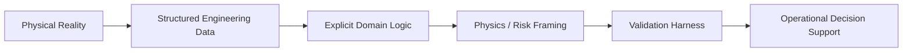

<!-- =========================================================
Felipe Rocha — Profile README (landing page)
Audience: technical peers · engineering-first · standards-traceable
========================================================== -->

<h1 align="center">Felipe Rocha</h1>

<p align="center">
  <strong>Asset Integrity Engineer</strong> — physics-first, standards-traceable simulators
</p>

<p align="center">
  <em>Open-source integrity simulators with governing equations documented in code,<br/>
  analytical benchmarks against textbook constants, and DOI-archived releases.</em>
</p>

<!-- Metrics band (every number is verifiable) -->
<p align="center">
  
  
  
  
</p>

<!-- Calls to action -->
<p align="center">
  <a href="https://github.com/felipearocha?tab=repositories"></a>
  <a href="https://github.com/felipearocha/integrity-code-series-dashboard"></a>
  <a href="https://zenodo.org/search?q=%22Felipe%20Rocha%22"></a>
  <a href="https://www.linkedin.com/in/felipe-rocha-7a944b133/"></a>
  <a href="mailto:feliper@infinitygrowth.ca"></a>
</p>

---

## Engineering Profile

I design and implement decision-support systems for asset-integrity and risk-based-inspection (RBI) programs — at the boundary of **engineering judgment, structured data systems, and physics-constrained machine learning**.

The objective is not algorithmic novelty. It is **defensible operational decisions**: explicit assumptions, transparent transformation logic, inspectable data lineage, bounded model behavior, and visible failure modes.

---

## Expertise

Core domains, and the methods & standards that sit under each.

| Domain | Methods &amp; Standards |
|---|---|
| **Asset Integrity &amp; RBI** | API 510 / 570 / 653 · API 571 (damage mechanisms) · API 580 / 581 (RBI) · API 579-1 / ASME FFS-1 · API RP 970 (CCDs) |
| **Corrosion &amp; Electrochemistry** | CO₂ corrosion (NORSOK M-506) · galvanic (Butler–Volmer / Laplace) · CUI · NNpH-SCC (Chen–Sutherby–Xing) · erosion-corrosion (DNV-RP-O501 / ASTM G119) · H₂ service (B31.12 / NACE TM0316) |
| **Physics-Informed ML (PIML)** | PINN surrogates · ODE-constrained training · KKT enforcement · gradient-boosted surrogates · Monte-Carlo uncertainty quantification |
| **Data Architecture &amp; Secure Automation** | ingestion-time validation · deterministic transforms · SHA-256 audit chains · CI/CD · reproducibility harnesses |

<p align="center">
  
  
  
  
  
  
  
  
</p>

---

## The Integrity Code Series

Self-contained, physics-first integrity simulators. Each package documents its governing PDEs/ODEs in code with `[SOURCE: Author Year]` tags, benchmarks against analytical constants, layers Monte-Carlo/sensitivity over the deterministic core, and ships a `run_all.py` that reproduces every figure.

> **Live status:** [integrity-code-series-dashboard](https://github.com/felipearocha/integrity-code-series-dashboard) — CI, releases and last-push, auto-refreshed monthly.

| # | Repository | Domain | Tests | Key standards / methods | DOI |
|---|---|---|:---:|---|---|
| **11** ⭐ | [erosion-corrosion-multiphase](https://github.com/felipearocha/integrity-code-series-week11-erosion-corrosion-multiphase) | Coupled erosion-corrosion at a multiphase elbow | **466** | NORSOK M-506 · DNV-RP-O501 · ASTM G119 · API 571 / 579 | [10.5281/zenodo.21114866](https://doi.org/10.5281/zenodo.21114866) |
| 10 | [nnph-scc](https://github.com/felipearocha/integrity-code-series-week10-nnph-scc) | Near-neutral-pH stress-corrosion cracking | 215 | Chen–Sutherby–Xing · BS 7910 · API 579 / 581 · Bayesian RBI | [10.5281/zenodo.20172241](https://doi.org/10.5281/zenodo.20172241) |
| 9 | [cui](https://github.com/felipearocha/integrity-code-series-week9-cui) | Corrosion under insulation (thermo-hygro-electrochemical) | 154 | 3 coupled PDEs · Strang splitting · DFOS inverse | [10.5281/zenodo.20172508](https://doi.org/10.5281/zenodo.20172508) |
| 8 | [creep-fatigue-heater](https://github.com/felipearocha/integrity-code-series-week8-creep-fatigue-heater) | Creep-fatigue in fired-heater tubes (9Cr-1Mo) | 324 | ASME III-5 · Norton/Omega · Coffin–Manson | [10.5281/zenodo.20172467](https://doi.org/10.5281/zenodo.20172467) |
| 7 | [h2-lferw](https://github.com/felipearocha/integrity-code-series-week7-h2-lferw) | Hydrogen conversion of vintage LF-ERW pipe | 182 | B31.12 · NACE TM0316 · seam-weld statistics | [10.5281/zenodo.20172481](https://doi.org/10.5281/zenodo.20172481) |
| 6 | [smartphone-galvanic](https://github.com/felipearocha/integrity-code-series-week6-smartphone-galvanic) | Galvanic corrosion in a thin electrolyte film | 38 | Laplace 2D · Butler–Volmer · oxide growth | [10.5281/zenodo.20172479](https://doi.org/10.5281/zenodo.20172479) |
| 3 | [f1-lap-simulation](https://github.com/felipearocha/integrity-code-series-week3-f1-lap-simulation) | F1 lap dynamics (six coupled ODEs) | 9 | arc-length ODE integration · thermal grip window | — |
| ⭐ | [synthetic-integrity-digital-twin-**piml**](https://github.com/felipearocha/synthetic-integrity-digital-twin-piml) | Physics-informed NN surrogate for an integrity digital twin | — | PINN · ODE-constrained · KKT enforcement | [10.5281/zenodo.20172483](https://doi.org/10.5281/zenodo.20172483) |
| ◆ | [vibration-accelerated-corrosion](https://github.com/felipearocha/Vibration-Accelerated-Corrosion-Coupled-Mechano-Electrochemical-Simulation) | Vibration-accelerated corrosion at pipe supports | — | SDOF · stress-modified Butler–Volmer · Archard | [10.5281/zenodo.20172485](https://doi.org/10.5281/zenodo.20172485) |
| ◆ | [integrity-data-foundation](https://github.com/felipearocha/integrity-data-foundation) | Engineering-first data validation baseline for RBI | — | schema validation · deterministic transforms | — |

<sub>⭐ flagship · ◆ companion package · test counts are from each repo's own suite.</sub>

---

## Method &amp; Rigor


```mermaid
flowchart LR
    A[Physical Reality] --> B[Structured Engineering Data]
    B --> C[Explicit Domain Logic]
    C --> D[Physics / Risk Framing]
    D --> E[Validation Harness]
    E --> F[Operational Decision Support]
```

Every model in the series is built to the same standard of evidence:

- **Traceable constants** — each equation and constant carries a `[SOURCE: Author Year]` tag with a tier (**T1** standard/paper · **T2** derived · **T3** practitioner). Modelling assumptions are labelled T3 and called out, never dressed as standards.
- **Analytical QC gates** — hand-calc benchmarks against textbook constants run before the model does.
- **Uncertainty, not point estimates** — a Monte-Carlo / sensitivity layer wraps every deterministic core.
- **Reproducibility** — `run_all.py` regenerates every figure; releases are archived to Zenodo with permanent DOIs.

> *If an assumption is not written, it fails silently.*
> *If data lineage is not explicit, the decision is not defensible.*
> *If a model cannot state its boundary conditions, it is not operational.*

---

## Cite &amp; Reproduce

Each package is archived on [Zenodo](https://zenodo.org/search?q=%22Felipe%20Rocha%22) with a **concept DOI** (always resolves to the latest version) and a machine-readable `CITATION.cff` that drives GitHub's *"Cite this repository"* widget.

```bibtex
@software{rocha_integrity_code_series,
  author    = {Rocha, Felipe},
  title     = {Integrity Code Series — physics-first integrity simulators},
  publisher = {Zenodo},
  url       = {https://github.com/felipearocha},
  note      = {Concept DOIs resolve to the latest archived release of each package.}
}
```

To reproduce any package: `pip install -r requirements.txt && python run_all.py`.

---

## Contact

Open to technical discussion on **asset-integrity digitalization, RBI architecture, physics-informed modeling, and engineering-grade automation**.

- ✉️ feliper@infinitygrowth.ca · felipe@olivainternationaltech.com
- 🔗 [linkedin.com/in/felipe-rocha-7a944b133](https://www.linkedin.com/in/felipe-rocha-7a944b133/)
